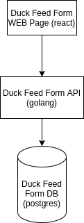
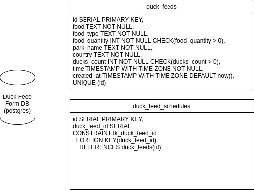

# Duck Feed API

## Running project

1. `make infrastructure/raise`
2. `make db/bootstrap` - you just need to run it at the first time to create table and indexes
3. `make start`

## Running tests

1. `make infrastructure/raise`
2. `make db/bootstrap` - you just need to run it at the first time to create table and indexes
3. `make test`

## Approach

I decided to implement a REST API using Golang (because is the language I feel more comfortable with) for the main application.

For schedule feature, I decided to create a worker that runs in parallel with the REST API (I decided to keep in the same project and running together with the application to reduce cost and time). This worker runs once a day and get all schedules stored in Database and create a new row using the Duck Feed Service.

## Technologies chosen

Golang, go-kit, go-pg, labstack echo, rollbar

## Component Diagram

## Database Diagram

## Hours Spent